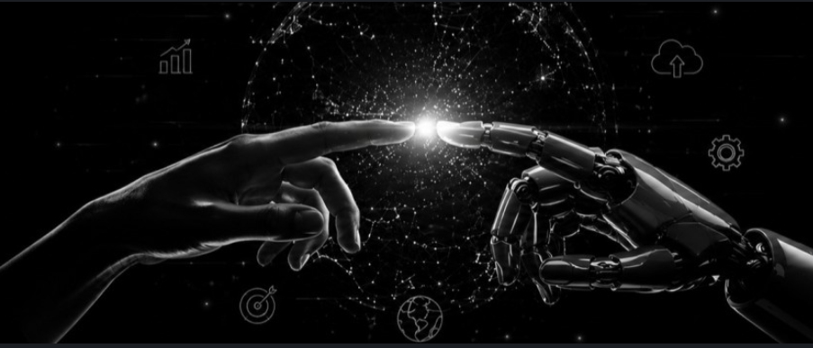

<div align="center">

 

<br><br>

# Robel Gebregziabher

### AI / Machine Learning Engineer in Training

**Building practical AI systems with Machine Learning, Deep Learning & Generative AI**

<br>

<a href="https://github.com/robelgher16-ai">

</a>
<a href="https://www.linkedin.com/in/robel-gebregziabher-4464762a2/">

</a>
<a href="https://www.upwork.com/freelancers/~010a1a953798c67751">

</a>

<br><br>


</div>

---

# About Me

I'm an **Information Technology student and AI Engineering intern** focused on building practical Artificial Intelligence systems.

My learning approach is simple:

> **Learn → Build → Deploy → Improve**

I work across:

* **Machine Learning**
* **Deep Learning**
* **Generative AI**
* **Natural Language Processing**
* **Computer Vision**
* **AI Engineering**
* **Data Analysis**

I enjoy turning AI concepts into complete applications — from data preparation and model development to APIs, interfaces, testing, and cloud deployment.

---

# AI Engineering Journey

```text
Data Analysis
      ↓
Machine Learning
      ↓
Deep Learning
      ↓
Computer Vision
      ↓
Generative AI
      ↓
RAG & AI Agents
      ↓
Production AI Systems
```

My goal is to become a strong **AI Engineer and AI researcher** while building systems that can create practical impact.

---

# Tech Stack

### Languages & Data

<p>


</p>

### Machine Learning

<p>


</p>

### Deep Learning & Computer Vision

<p>


</p>

### Generative AI

<p>


</p>

### Vector Databases & RAG

<p>


</p>

### Applications & APIs

<p>


</p>

### Development & Deployment

<p>


</p>

---

# Featured Projects

## Machine Learning

### House Price Prediction

**Machine Learning regression project with model comparison and deployment.**

```text
EDA
 ↓
Preprocessing
 ↓
Feature Engineering
 ↓
Multiple ML Models
 ↓
Model Evaluation
 ↓
FastAPI
 ↓
Streamlit
 ↓
Render
```

**Technologies:** Python · Pandas · NumPy · Scikit-learn · XGBoost · LightGBM · CatBoost · FastAPI · Streamlit

[View Project](https://github.com/robelgher16-ai/MACHINE_LEARNING_PROJECTS)

[Live Streamlit App](https://house-price-predictor-robel.streamlit.app/)

[Live API](https://house-price-api-7y5w.onrender.com)

---

# Generative AI

### Movie Information Extractor

**Extract structured movie information from natural-language descriptions using Generative AI.**

```text
Movie Description
       ↓
Gemini / TinyLlama
       ↓
LangChain
       ↓
Structured Output
       ↓
Pydantic Validation
       ↓
Streamlit / FastAPI
       ↓
Render
```

**Technologies:** Python · LangChain · Gemini · TinyLlama · Pydantic · Streamlit · FastAPI · Render

[View Generative AI Repository](https://github.com/robelgher16-ai/GENERATIVE_AI_PROJECTS)

[Live Streamlit App](https://robelgher16-ai-genera-movie-information-extractorapp-api-0b0ucj.streamlit.app/)

[Live API](https://movie-information-extractor-api.onrender.com)

[Swagger API](https://movie-information-extractor-api.onrender.com/docs)

---

# Project Areas

<div align="center">

| Area             | Repository                                                                               | Focus                                        |
| ---------------- | ---------------------------------------------------------------------------------------- | -------------------------------------------- |
| Data Analysis    | [DATA_ANALYSIS_PROJECTS](https://github.com/robelgher16-ai/DATA_ANALYSIS_PROJECTS)       | Data exploration, statistics & visualization |
| Machine Learning | [MACHINE_LEARNING_PROJECTS](https://github.com/robelgher16-ai/MACHINE_LEARNING_PROJECTS) | Classical ML & model development             |
| Deep Learning    | [DEEP_LEARNING_PROJECTS](https://github.com/robelgher16-ai/DEEP_LEARNING_PROJECTS)       | Neural networks & deep learning              |
| Generative AI    | [GENERATIVE_AI_PROJECTS](https://github.com/robelgher16-ai/GENERATIVE_AI_PROJECTS)       | LLMs, RAG & AI applications                  |

</div>

---

# Currently Building

I'm continuously expanding my AI engineering portfolio through practical projects.

### Current Focus

* Machine Learning model development
* Deep Learning with PyTorch
* Computer Vision
* Generative AI
* Retrieval-Augmented Generation
* LLM applications
* FastAPI AI backends
* AI application deployment
* AI agents and automation

---

# Engineering Philosophy

```text
Understand the theory
        ↓
Implement the concept
        ↓
Build a project
        ↓
Evaluate the result
        ↓
Improve the system
        ↓
Deploy it
        ↓
Document it
```

I don't want to only learn AI concepts.

I want to **build systems with them.**

---

# GitHub Statistics

<div align="center">


<br>


</div>

---

# Contribution Activity

<div align="center">


</div>

---

# Let's Connect

<div align="center">

<a href="https://www.linkedin.com/in/robel-gebregziabher-4464762a2/">

</a>

<a href="https://www.upwork.com/freelancers/~010a1a953798c67751">

</a>

<a href="https://www.instagram.com/robity16/">

</a>

<a href="https://www.facebook.com/profile.php?id=61591501846842">

</a>

<br><br>

**Building today. Learning every day. Improving continuously.**

</div>
